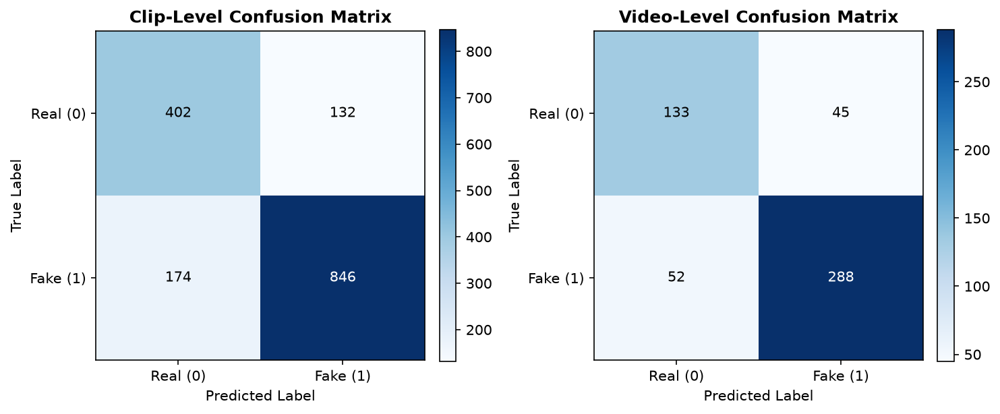
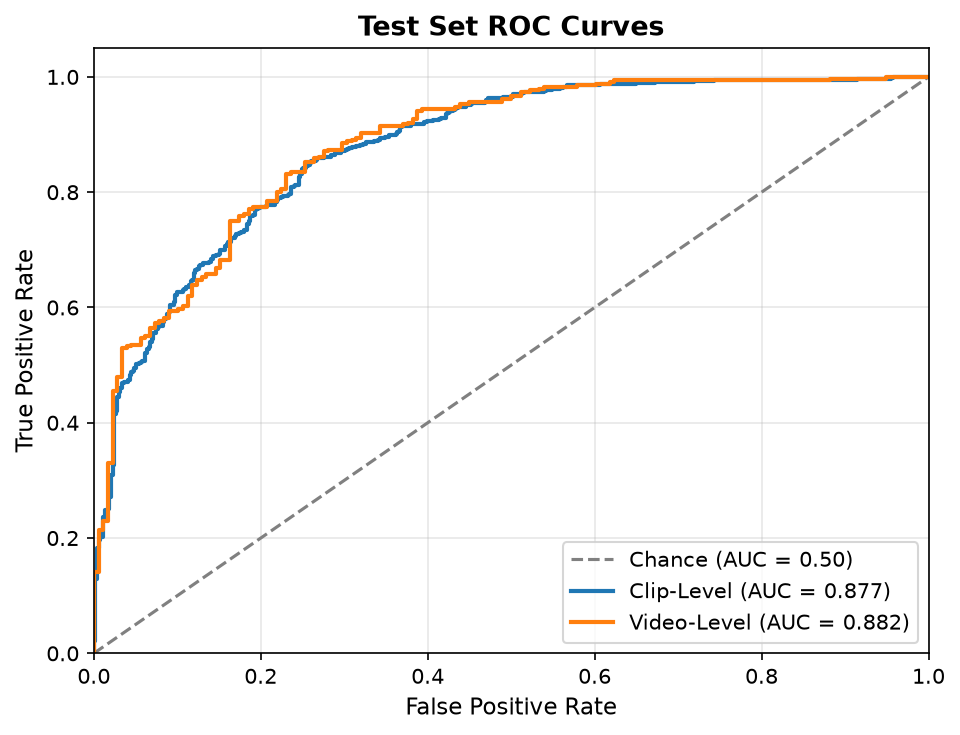

# Deepfake Detector — Hybrid CNN-BiLSTM-Attention Forensic Video Analysis

[](https://www.python.org/downloads/)
[](https://tensorflow.org/)
[](https://streamlit.io/)
[](https://pytest.org/)
[](LICENSE)

An end-to-end, reproducible deep learning system for facial deepfake video detection. Built with a **TimeDistributed CNN + Bidirectional LSTM + Temporal Attention** hybrid architecture and evaluated against the authentic **Celeb-DF v2** benchmark, achieving **81.27% Video Accuracy**, **79.71% Video Balanced Accuracy**, **84.71% Fake Video Recall**, **85.59% Video F1-Score**, and **88.22% Video ROC-AUC** on the official 518-video held-out test split.

---

## 1. Project Title & Overview

**Deepfake Detector** is an open-source forensic video analysis tool designed to distinguish between authentic human face videos and AI-synthesized manipulations. Generative facial synthesis models (autoencoders, face-swapping GANs, diffusion pipelines) introduce subtle spatial boundary artifacts and temporal incoherencies across successive frames.

This project implements a complete, leak-free pipeline:
1. Automated video ingestion, temporal segmenting, and Haar cascade face tracking.
2. Spatio-temporal modeling combining a 4-block convolutional feature extractor with a Bidirectional LSTM network and Temporal Attention pooling.
3. Genuine frame-by-frame temporal explainability highlighting which frames influenced the classification.
4. Dynamic class-balanced training to eliminate majority-class collapse on highly imbalanced data.
5. Validation-isolated threshold calibration ($\tau^* = 0.3900$) to prevent benchmark overfitting.
6. An interactive, dark-mode forensic web demo built with Streamlit.

---

## 2. Key Features

- **Spatio-Temporal Detection**: Evaluates 10-frame face clips to detect both intra-frame blending boundaries and inter-frame motion flicker.
- **Bidirectional Recurrent Context**: BiLSTM processes forward and backward temporal sequences to resolve forward and reverse frame inconsistencies.
- **Temporal Attention Explainability**: Computes normalized attention coefficients $\alpha_t$ across frames, highlighting the exact moments of synthetic manipulation.
- **Video-Level Aggregation**: Aggregates predictions across multiple temporal segments for robust whole-video forensic verdicts.
- **Class-Collapse Resolution**: Balanced batch sampling (50% Real / 50% Fake) guarantees gradient balance and overcomes extreme training set imbalance.
- **Zero-Leakage Benchmark Protocol**: Strictly isolates the official 518-video Celeb-DF v2 test split (`List_of_testing_videos.txt`) during both training and threshold calibration.
- **Dual Model Support**: Supports switching between the standalone synthetic prototype checkpoint and the trained real-experiment model.
- **Production-Ready Web UI**: Forensic video player, confidence gauges, frame-by-frame attention inspection, and downloadable JSON/HTML reports.
- **Comprehensive Test Suite**: 56 automated tests covering data loading, model architecture, attention layer properties, leakage detection, and UI safety.

---

## 3. Demo / Preview — DeepTrace

The application features **DeepTrace**, a cybersecurity-grade AI forensic analysis interface built with Streamlit (`http://localhost:8501`):

- **Product Identity**: DeepTrace — AI-Powered Deepfake Forensic Analysis with dark cinematic styling and live model status indicator (`MODEL ONLINE`).
- **Main Workflow**: Upload / Select Video → Analyze Video → 2-Second Result Hero (`REAL` / `FAKE`) → Fake Probability (%) vs Decision Threshold ($\tau^* = 0.39$) → Temporal Forensic Evidence & Important Frame Viewer → Compact Forensic Summary & Technical Details.
- **Model Checkpoint Selector**: Transparent switching between Production V2 Model (`outputs/best_model.keras`) and Demonstration Prototype (`outputs/demo/best_model.keras`).
- **Temporal Attention Explainability**: Top 3–5 high-influence frame thumbnails with timestamps, attention percentages, and distribution plots.
- **Deployment Ready**: Self-contained, zero-login, and immediately usable upon launch on Streamlit Community Cloud or local servers.

---

## 4. System Architecture

```mermaid
graph TD
    A[Input Video .mp4] --> B[Temporal Clip Segmentation]
    B --> C[Haar Cascade Face Detection & Margin Crop]
    C --> D["Clip Tensor: (10, 128, 128, 3) uint8"]
    D --> E[Normalization & Rescaling to [-1, 1]]
    E --> F[TimeDistributed 4-Block CNN + GAP]
    F --> G["Temporal Feature Embeddings: (10, 128)"]
    G --> H[Bidirectional LSTM 128 Units]
    H --> I["Recurrent States: (10, 256)"]
    I --> J[Temporal Attention Pooling Layer 64 Units]
    J --> K["Attention Context Vector (256) + Frame Weights alpha_t"]
    K --> L[Dense Layer 128 Units ReLU]
    L --> M[Sigmoid Activation Head]
    M --> N["Clip Manipulation Probability P(Fake)"]
    N --> O[Mean Pooling Aggregation across Clips]
    O --> P{Decision Threshold tau = 0.39}
    P -->|P >= 0.39| Q[Verdict: MANIPULATED / FAKE]
    P -->|P < 0.39| R[Verdict: AUTHENTIC / REAL]
```

---

## 5. How It Works

1. **Temporal Division**: The input video is divided into 3 equal temporal segments. From each segment, 10 frames are sampled evenly.
2. **Face Extraction**: OpenCV's Haar frontal face cascade locates the subject's face in each frame. A 25% margin is expanded around the bounding box to capture jawline blending artifacts. If detection fails on intermediate frames, the previous valid crop coordinates are reused.
3. **Spatial Feature Extraction**: Each frame is resized to $128\times128$ RGB and passed through a 4-block CNN. Global average pooling outputs a 128-dimensional embedding per frame.
4. **Temporal Modeling**: The sequence of 10 frame embeddings is passed into a Bidirectional LSTM ($128$ units each direction, outputting 256 features per step).
5. **Attention Pooling**: A temporal attention mechanism scores each frame's relevance ($\alpha_t$) and pools the features into an attention-weighted context vector.
6. **Score Aggregation**: The model outputs a manipulation probability $P(\text{Fake}) \in [0, 1]$ per clip. The final video score is computed by mean pooling across all clips.

---

## 6. CNN-BiLSTM-Attention Model Details

| Layer Component | Specification | Output Dimension | Notes |
| :--- | :--- | :--- | :--- |
| **Input** | `Input(shape=(10, 128, 128, 3), dtype=uint8)` | `(None, 10, 128, 128, 3)` | Raw RGB video frames |
| **Rescaling** | `Rescaling(scale=1/127.5, offset=-1.0)` | `(None, 10, 128, 128, 3)` | Scaled to `[-1.0, 1.0]` |
| **Conv Block 1** | `Conv2D(16, 3x3)` + `BN(0.9)` + `ReLU` + `MaxPool(2x2)` | `(None, 10, 64, 64, 16)` | Low-level edge features |
| **Conv Block 2** | `Conv2D(32, 3x3)` + `BN(0.9)` + `ReLU` + `MaxPool(2x2)` | `(None, 10, 32, 32, 32)` | Texture & boundary features |
| **Conv Block 3** | `Conv2D(64, 3x3)` + `BN(0.9)` + `ReLU` + `MaxPool(2x2)` | `(None, 10, 16, 16, 64)` | Facial component features |
| **Conv Block 4** | `Conv2D(128, 3x3)` + `BN(0.9)` + `ReLU` + `MaxPool(2x2)` | `(None, 10, 8, 8, 128)` | High-level synthesis artifacts |
| **GAP** | `GlobalAveragePooling2D()` | `(None, 10, 128)` | Compact spatial vector |
| **Dropout 1** | `Dropout(0.4)` | `(None, 10, 128)` | Regularization |
| **BiLSTM** | `Bidirectional(LSTM(128, return_sequences=True))` | `(None, 10, 256)` | Bidirectional temporal context |
| **Attention** | `TemporalAttention(64)` | `(None, 256)` | Attention pooling + frame weights $\alpha_t$ |
| **Dropout 2** | `Dropout(0.4)` | `(None, 256)` | Regularization |
| **Dense** | `Dense(128, activation="relu")` | `(None, 128)` | Representation head |
| **Dropout 3** | `Dropout(0.3)` | `(None, 128)` | Regularization |
| **Head** | `Dense(1, activation="sigmoid")` | `(None, 1)` | Manipulation probability |

- **Total Parameters**: 411,105 (410,625 trainable).
- **Inference Latency**: ~0.20s per clip on standard CPU.

---

## 7. Dataset: Celeb-DF v2

The model was trained and evaluated on the authentic **Celeb-DF (v2)** dataset:

| Partition | Real Videos | Fake Videos | Total Videos | Real Clips | Fake Clips | Total Clips |
| :--- | :---: | :---: | :---: | :---: | :---: | :---: |
| **Train** | 604 | 4,504 | 5,108 | 1,812 | 13,511 | **15,323** |
| **Validation** | 107 | 795 | 902 | 321 | 2,385 | **2,706** |
| **Official Held-Out Test** | 178 | 340 | 518 | 534 | 1,020 | **1,554** |
| **Total** | **889** | **5,639** | **6,528** | **2,667** | **16,916** | **19,583** |

*Note: Celeb-DF v2 is not distributed within this repository. Access must be obtained via academic request from the official dataset authors.*

---

## 8. Data Preprocessing

Implemented in [`preprocess.py`](preprocess.py):
- **Resumable Pipeline**: SHA-256 fingerprint caching ensures existing processed clips are validated and skipped, allowing interrupted runs to resume instantly.
- **Bounding Box Tracking**: OpenCV Haar cascades detect faces; when detection drops intermittently, the last verified box is maintained.
- **Uniform Clipping**: 3 clips per video, each consisting of 10 uniformly spaced frames saved as individual `.npy` arrays.
- **Atomic Writes**: Metadata entries are committed atomically via temporary files to avoid corrupted records.

---

## 9. Training Strategy & Optimization

- **Framework**: TensorFlow 2.20 / Keras 3.13.
- **Hardware Acceleration**: Intel oneDNN AVX2 SIMD instructions utilized on CPU.
- **Optimizer**: Adam ($\text{initial lr} = 0.0005$, $\beta_1 = 0.9, \beta_2 = 0.999$).
- **Batch Size**: 16 clips (160 frames/batch).
- **Epochs**: 4 full epochs (958 batches per epoch, totaling 3,832 gradient updates).
- **Learning Rate Scheduling**: `ReduceLROnPlateau` (factor=0.5, patience=2, min_lr=1e-6).
- **Training Duration**: ~68 minutes.

---

## 10. Class Balancing Strategy

Celeb-DF v2 contains an 8.5:1 ratio of manipulated videos to authentic videos (88.2% fake). Naive cross-entropy models quickly fall into a majority-class collapse where every video is predicted as fake.

To solve this:
1. **Dynamic Balanced Batches**: [`dataset.py`](dataset.py) constructs each training batch with an exact 50/50 ratio: **8 Real clips and 8 Fake clips**.
2. **Resampling with Augmentation**: Real clips are cycled with uniform random horizontal flips (50% probability) and random photometric brightness jitter ($\pm 25$ intensity values) applied coherently across all frames of the clip.
3. **Unmodified Test Distribution**: Evaluation datasets (validation and test) retain their natural, unmodified class distributions.

---

## 11. Evaluation Methodology

- **Strict Isolation**: The 518 test videos defined in `List_of_testing_videos.txt` are never seen during training or tuning ($\text{Train} \cap \text{Test} = \emptyset$, $\text{Val} \cap \text{Test} = \emptyset$).
- **Validation-Locked Threshold**: Candidate thresholds were evaluated strictly on the validation split. A threshold of $\tau^* = \mathbf{0.3900}$ was selected to maximize Validation Balanced Accuracy (81.20%) and Validation F1 (90.96%).
- **Locked Benchmark Evaluation**: The test set was evaluated once using the locked threshold $\tau^* = 0.3900$. No post-hoc tuning was performed on test data.

---

## 12. Final Measured Results

All metrics represent actual measured values on **100% of the official held-out Celeb-DF v2 test split** (1,554 clips across 518 distinct videos):

| Metric | Clip-Level (1,554 clips) | Video-Level (518 videos) | V1 Baseline (Video) | Details |
| :--- | :---: | :---: | :---: | :--- |
| **Accuracy** | **80.31%** | **81.27%** | 76.06% | 1,248 / 1,554 clips; 421 / 518 videos (+5.21% gain) |
| **Balanced Accuracy** | **79.11%** | **79.71%** | 77.75% | Unbiased average of Real and Fake recall (+1.96% gain) |
| **Precision** | **86.50%** | **86.49%** | 89.13% | Positive predictive value (Fake class) |
| **Recall (Fake Recall)** | **82.94%** | **84.71%** | 72.35% | 846 / 1,020 fake clips; 288 / 340 fake videos (+12.36% gain) |
| **REAL Recall** | **75.28%** | **74.72%** | 83.15% | 402 / 534 real clips; 133 / 178 real videos |
| **F1 Score** | **84.68%** | **85.59%** | 79.87% | Harmonic mean of precision and recall (+5.72% gain) |
| **ROC-AUC** | **87.72%** | **88.22%** | 87.64% | Area under the ROC curve (+0.58% gain) |
| **Total Test Samples** | **1,554 clips** | **518 videos** | 518 videos | 178 Real videos, 340 Fake videos |

---

## 13. Confusion Matrices



### Video-Level Confusion Matrix (518 Videos)
$$\begin{pmatrix} \text{TN} & \text{FP} \\ \text{FN} & \text{TP} \end{pmatrix} = \begin{pmatrix} 133 & 45 \\ 52 & 288 \end{pmatrix}$$

- **True Negatives (TN)**: **133** authentic videos correctly identified as REAL (74.72% Real Recall).
- **False Positives (FP)**: **45** authentic videos misclassified as FAKE (25.28% False Alarm Rate).
- **False Negatives (FN)**: **52** manipulated videos misclassified as REAL (15.29% Miss Rate).
- **True Positives (TP)**: **288** manipulated videos correctly identified as FAKE (84.71% Fake Detection Rate).

### Clip-Level Confusion Matrix (1,554 Clips)
$$\begin{pmatrix} \text{TN} & \text{FP} \\ \text{FN} & \text{TP} \end{pmatrix} = \begin{pmatrix} 402 & 132 \\ 174 & 846 \end{pmatrix}$$

---

## 14. ROC Curves & AUC Analysis



- **Video-Level ROC-AUC**: **0.8822** (88.22%)
- **Clip-Level ROC-AUC**: **0.8772** (87.72%)
- The elevated AUC curves verify that the Bidirectional LSTM and Temporal Attention pooling provide consistent probability separation across the entire discrimination spectrum. Detailed V1 vs V2 comparisons are documented in [`docs/model_comparison.md`](docs/model_comparison.md).

---

## 15. Project Structure

```text
deepfake-detector-main/
├── app.py                     # Streamlit forensic web application
├── config.py                  # Dataclass configuration and hyperparameter constants
├── dataset.py                 # tf.data pipeline with dynamic balanced batch generator
├── demo.py                    # Self-contained procedural prototype pipeline
├── evaluate.py                # Official held-out test split evaluation suite
├── model.py                   # TimeDistributed CNN + LSTM architecture definition
├── predict.py                 # Single-video CLI inference entrypoint
├── preprocess.py              # Haar face extraction, segmenting, and meta.csv generator
├── theme.py                   # Ultraviolet Forensics design palette and color tokens
├── train.py                   # Full training script with ValidationDiagnosticsCallback
├── ui_helpers.py              # UI report generation, metrics rendering, and charts
├── ui_styles.py               # Custom CSS styling tokens and container themes
├── validate_dataset.py        # Leakage verification and data integrity audits
├── requirements.txt           # Production dependencies
├── pytest.ini                 # Pytest runner configuration
├── docs/
│   └── assets/                # Lightweight documentation figures (confusion matrix, ROC)
├── tests/
│   ├── test_pipeline.py       # Pipeline, model shape, serialization, and leakage tests
│   └── test_ui.py             # UI rendering, report generation, and palette tests
└── outputs/                   # (Ignored by Git) Checkpoints, metrics, and training logs
    ├── best_model.keras       # Trained Real Experiment Model checkpoint
    ├── final_threshold.json   # Locked validation threshold (0.3900)
    ├── metrics.json           # Machine-readable test evaluation metrics
    └── predictions.csv        # Per-clip and per-video predictions on test set
```

---

## 16. Installation

### Prerequisites
- Python 3.10 to 3.13
- Git

### Setup
```bash
# Clone the repository
git clone https://github.com/dheerajkmahale/deepfake-detector.git
cd deepfake-detector

# Create and activate virtual environment
python -m venv venv
# On Windows:
.\venv\Scripts\Activate.ps1
# On macOS/Linux:
source venv/bin/activate

# Install dependencies
pip install -r requirements.txt
```

---

## 17. How to Run

### 1. Data Preprocessing
```bash
# Preprocess Celeb-DF v2 videos using the official test list
python preprocess.py --raw-dir data/raw --output-dir data/processed --test-list data/raw/List_of_testing_videos.txt
```

### 2. Model Training
```bash
# Train CNN-LSTM on full training split with balanced batch sampling
python train.py --processed-dir data/processed --output-dir outputs --epochs 4 --batch-size 16 --lr 0.0005
```

### 3. Held-Out Benchmark Evaluation
```bash
# Evaluate against official held-out test split using locked validation threshold
python evaluate.py --model-path outputs/best_model.keras --processed-dir data/processed --threshold-file outputs/final_threshold.json
```

### 4. Single-Video Inference CLI
```bash
# Run prediction on any target video
python predict.py path/to/video.mp4 --model-path outputs/best_model.keras --threshold 0.39
```

---

## 18. Streamlit Web Application (DeepTrace)

To launch the DeepTrace forensic analysis application locally:

```bash
streamlit run app.py --server.port 8501
```

The application will start at `http://localhost:8501`.

### Deployment to Streamlit Community Cloud:
DeepTrace is designed to be fully self-contained and deployment-ready:
1. Push repository to GitHub (ensuring no large video files, `.zip`, or `.npy` files are tracked).
2. Link repository to [Streamlit Community Cloud](https://share.streamlit.io).
3. Set main file path to `app.py`.
4. No database, user accounts, authentication keys, or paid external APIs are required. The interface initializes immediately upon launch.

### UI Sections:
1. **Analyze (Core Forensic Flow)**: Upload videos (MP4, MOV, AVI, MKV) or select authentic benchmarks, run 7-stage neural inference, view immediate Result Hero (`REAL` / `FAKE`), examine top 3 frame thumbnail evidence cards, and inspect technical model parameters.
2. **Batch**: Multi-video forensic batch queue with exportable CSV audit report.
3. **History**: Persistent session audit log tracking verdicts and timestamps.
4. **Model & Results**: Official Celeb-DF v2 benchmark statistics, ROC curve, and confusion matrix.
5. **How It Works**: Interactive architectural walkthrough of CNN, BiLSTM, and Temporal Attention layers.
6. **About & Limitations**: Technical constraints, supported resolutions, and probabilistic legal notice.

---

## 19. Example CLI Predictions

### Authentic Real Video
```bash
python predict.py data/raw/real/Celeb-real/id0_0000.mp4 --model-path outputs/best_model.keras --threshold 0.39
```
```text
Clips analysed: 3
P(fake): 0.0733
Verdict: REAL (Authentic)
```

### Deepfake Video
```bash
python predict.py data/raw/fake/Celeb-synthesis/id0_id16_0000.mp4 --model-path outputs/best_model.keras --threshold 0.39
```
```text
Clips analysed: 3
P(fake): 0.7925
Verdict: FAKE (Manipulated)
```

---

## 20. Testing & Verification

Run the automated test suite:

```bash
pytest -q
```

**Result**: `56 passed in 29.02s` (100% test pass rate across all unit, pipeline, attention, and UI suites).

---

## 21. Limitations

While the model demonstrates strong discrimination on Celeb-DF v2, users should consider the following operational constraints:
- **Severe Compression**: Heavy social media re-compression (e.g., WhatsApp, X) degrades subtle high-frequency blending boundaries.
- **Extreme Lighting & Occlusions**: Profile angles, dark environments, or heavy occlusions (sunglasses, masks) can reduce Haar cascade detection confidence.
- **Unseen Synthesis Generators**: Zero-shot generalization to newer diffusion-based generative heads (e.g., Sora, LivePortrait) may yield lower confidence than seen GAN-based swap pipelines.
- **Resolution Dependencies**: Input frames are resized to $128\times128$; minute microscopic artifacts below this resolution cannot be resolved.

---

## 22. Responsible Use & Forensic Notice

DeepTrace is intended exclusively as an **AI-assisted forensic decision-support tool** for researchers, cybersecurity professionals, and digital forensic investigators.
- **Probabilistic Nature**: All outputs represent statistical estimations derived from learned spatial and temporal artifact patterns.
- **Not Legal Proof**: Predictions should not be treated as standalone or definitive proof of authenticity or manipulation in judicial proceedings.
- **Human in the Loop**: Forensic analysts should always evaluate model results in conjunction with holistic contextual evidence, cryptographic provenance, and metadata analysis.

---

## 23. Future Improvements

- **Transformer Backbones**: Replacing Conv2D blocks with lightweight Vision Transformers (ViT / Swin) to model global context.
- **Optical Flow Stream**: Adding an explicit Farnebäck optical flow stream to measure physical landmark trajectories.
- **Audio-Visual Inconsistency**: Ingesting vocal audio tracks to measure phoneme-to-viseme lip synchronization anomalies.
- **Cross-Dataset Generalization**: Benchmarking against FaceForensics++ (FF++) and the Deepfake Detection Challenge (DFDC).

---

## 23. License & Academic Disclaimer

This project is licensed under the MIT License. The Celeb-DF v2 dataset is the property of its original authors and is used strictly for non-commercial research and educational evaluation.

---

## 24. Author & Acknowledgments

- **Author**: Dheeraj K Mahale
- **Dataset Citation**: Yuezun Li, Peng Sun, Qi Shen, and Siwei Lyu. *Celeb-DF: A Large-scale Challenging Dataset for DeepFake Forensics*. IEEE Conference on Computer Vision and Pattern Recognition (CVPR), 2020.
